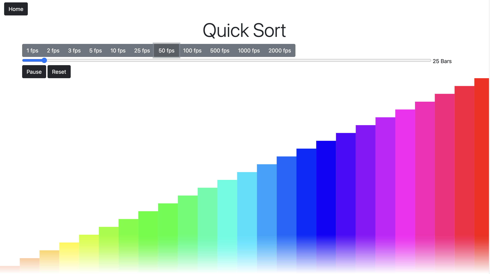

# Sorting Algorithm Visualizer

A small web app that animates five sorting algorithms as colored bars: bubble sort, selection sort, merge sort, quick sort and heap sort. Flask serves the pages and the animation runs in the browser with p5.js.

The app was deployed to AWS Lambda and API Gateway with [Zappa](https://github.com/zappa/Zappa), and the Zappa settings are still in the repository. That deployment has since been taken down, so there is no live demo. To try the app, run it locally as described below.



## What it does

The home page links to one page per algorithm. Each algorithm page has:

- A canvas of bars, one per array element. The height and color of a bar come from the element's value. The element the algorithm is working on at each step (for example the one being compared or written) is drawn in black.
- Frame-rate buttons from 1 to 2000 fps (default 5). p5.js draws at most once per screen refresh, so the settings above the display's refresh rate behave the same.
- A slider for the number of bars, from 1 to 500 (default 25).
- A button that switches between Start and Pause, and a Reset button.
- A written description of the algorithm and code listings for it in JavaScript, Python and Java, highlighted by Prism.
- A Home link back to the list of algorithms.

Moving the slider or pressing Reset generates a new shuffled array of the values 1 to n.

## How it works

- `app.py` is a Flask app with six routes: `/` and one per algorithm (`/bubble_sort`, `/selection_sort`, `/merge_sort`, `/quick_sort`, `/heap_sort`). Each route only renders a template. There are no API endpoints and nothing is sorted on the server.
- Each algorithm page loads its own script from `static/js/`. When Start is pressed, the script runs the sort on a copy of the array and records a snapshot of the array, plus the index to highlight, at every step. The p5.js `draw()` loop then plays the snapshots back at the selected frame rate, advancing more snapshots per frame as the array gets larger.
- Links between pages and to the files under `static/` are built with Flask's `url_for`, so they follow the path the app is served under: `/` locally, `/dev/` behind the API Gateway stage.
- The templates load Bootstrap 5.1.0 and Popper 2.9.3 from jsDelivr, and Prism 1.30.0 and p5.js 1.7.0 from cdnjs, so the pages need internet access even when the app runs locally.
- Each of those script and stylesheet tags carries a Subresource Integrity hash, so a browser refuses a file that is not byte for byte the one the hash was taken from. The Bootstrap and Popper hashes are the ones Bootstrap published with its 5.1.0 release, and the Prism and p5.js hashes are the ones cdnjs publishes (for p5.js at `https://api.cdnjs.com/libraries/p5.js/1.7.0?fields=sri`). To change a version, change the URL in every template that has it and replace the hash with `sha512-` followed by the output of `curl -s <url> | openssl dgst -sha512 -binary | openssl base64 -A`.

## Repository layout

| Path | Contents |
| --- | --- |
| `app.py` | Flask application and routes |
| `templates/` | `index.html` and one template per algorithm |
| `static/js/` | one p5.js sketch per algorithm (step recording and playback) |
| `static/css/` | page styles |
| `static/visualization.png` | the screenshot above |
| `tests/test_routes.py` | route and link checks, run with pytest |
| `tests/test_sorting.py` | runs the Python and JavaScript listings from the pages and the step recording of each sketch, with pytest |
| `tests/test_scripts.py` | checks on the scripts each page loads, run with pytest |
| `pytest.ini` | pytest settings |
| `.github/workflows/ci.yml` | GitHub Actions workflow: the tests and a dependency audit |
| `zappa_settings.json` | Zappa configuration for the `dev` stage |
| `requirements.txt` | what the app needs to run: Flask and Flask-Cors, pinned |
| `requirements-deploy.txt` | the pinned environment of the 2023 Zappa deployment, historical and unaudited |

## Run locally

You need Python 3.9 or newer and pip.

```bash
git clone https://github.com/shubhroses/algoVisualizer.git
cd algoVisualizer
python3 -m venv venv
source venv/bin/activate        # Windows: venv\Scripts\activate
pip install -r requirements.txt
python app.py
```

Then open http://127.0.0.1:5001/.

`requirements.txt` pins the two packages `app.py` imports: Flask 3.1.3 and Flask-Cors 6.0.5. pip also installs the packages those two depend on (Werkzeug, Jinja2, MarkupSafe, itsdangerous, click and blinker) at the newest versions they allow. Zappa is not installed. It is only needed for deployment, which has its own section below.

Checked in October 2026 on macOS: `requirements.txt` installs on Python 3.10, 3.13 and 3.14, the tests pass on all three, and `pip-audit -r requirements.txt` reports no known vulnerabilities.

## Run the tests

In the same virtual environment:

```bash
pip install pytest
pytest
```

The run should report 59 passed. Ten of those tests need [Node.js](https://nodejs.org/). If `node` is not on the PATH they are skipped and the run reports 49 passed, 10 skipped.

The test files use Flask's test client, so no server and no browser need to be running.

`tests/test_routes.py` checks that every page returns 200, that every link on a page that points back into the app (other pages and the files under `static/`) also returns 200, and that the home page and the algorithm pages link to each other. Each check runs twice: with the app at the site root, and with the app mounted under `/dev`, the way it sits behind an API Gateway stage.

`tests/test_sorting.py` takes the Python and JavaScript listings out of each rendered algorithm page and runs them on a few hundred arrays: every array of up to five values drawn from 1, 2 and 3, which includes the empty array, single elements and repeated values, and some longer arrays of random digits. Each result has to match Python's `sorted()`. A listing runs in a process of its own with a 10 second limit, so one that never returns fails its test instead of hanging the run. The JavaScript listings run under `node`. The Java listings are not run.

The same file runs the `sortSteps` function of each p5.js sketch in `static/js/` under `node`, on the arrays above that have at least two elements, and checks that the last snapshot it records, the frame the animation ends on, is the sorted array. The drawing code in the sketches needs a browser and is not run.

`tests/test_scripts.py` reads the tags out of each rendered page. It checks that every element id the page's own scripts look up with `getElementById` exists on that page. For the algorithm pages it also checks that Prism can highlight every listing: the page loads a Prism theme, the Prism core comes before the other Prism scripts, and every listing language outside the core has its component script. It checks that every script and stylesheet a page loads from another site has an exact version in its URL, an integrity hash and `crossorigin="anonymous"`. Whether a hash matches its file is not something these tests can tell without network access. A browser checks that on every page load. The five algorithm pages share one layout, so one more test compares every tag that has attributes across the five. That covers the files they load, the controls and the tabs, and leaves out the description text, which is written with plain tags.

## Continuous integration

`.github/workflows/ci.yml` runs on every push and pull request, with two jobs:

- Tests: installs `requirements.txt` and pytest on Python 3.12, sets up Node.js 24 for the tests that run JavaScript, and runs `pytest`.
- Dependency audit: runs `pip-audit -r requirements.txt`, which fails when a known vulnerability is published for Flask, Flask-Cors or a package they depend on.

The workflow has read-only access to the repository, and the actions it uses are pinned to commit SHAs. `requirements-deploy.txt` is not audited.

## Deploy to AWS Lambda with Zappa

`zappa_settings.json` defines one stage, `dev`, which packages `app.app` for Lambda and exposes it through API Gateway. Deployment is not covered by the tests or by CI.

`requirements.txt` does not install Zappa. `requirements-deploy.txt` holds the 34 pins the app was deployed from in September 2023: Zappa 0.57.0, the AWS libraries it depends on, and Flask 2.3.3 with its dependencies. That file is historical and unaudited. It is kept as a record of the deployment, nothing checks it, and in October 2026 `pip-audit` reported known vulnerabilities in 10 of its 34 packages, Flask, Flask-Cors, Werkzeug and Jinja2 among them. Zappa packages the virtual environment it is run from, so deploying from these pins would put those versions on Lambda.

To rebuild that environment anyway, run `pip install -r requirements-deploy.txt` in a separate virtual environment on Python 3.8, 3.9 or 3.10. The Flask 2.3.3 pin needs at least Python 3.8, and Zappa 0.57.0 refuses to run on anything newer than 3.10. This was checked on Python 3.10.

For a new deployment, install a current Zappa release on top of `requirements.txt` instead: `pip install -r requirements.txt zappa`. In October 2026 that installs Zappa 0.63.0 on Python 3.13 without dependency conflicts. Deploying with it has not been tested.

Before deploying to your own AWS account, edit these keys in `zappa_settings.json`:

- `profile_name`: the AWS CLI profile to deploy with (the file says `default`).
- `s3_bucket`: a bucket of your own for the deployment package. The value in the file is a placeholder.
- `runtime`: currently `python3.8`, which AWS Lambda deprecated in October 2024. Set a runtime that AWS still supports. Zappa 0.57.0 does not run on anything newer than Python 3.10, so a newer runtime also needs a newer Zappa release.

Then, from the virtual environment that has Zappa installed:

```bash
zappa deploy dev      # first deployment
zappa update dev      # redeploy after changes
zappa undeploy dev    # remove the deployment
```

API Gateway serves the app under the stage name, as in `https://<api-id>.execute-api.<region>.amazonaws.com/dev/`. The pages build their links with `url_for`, so they work under that prefix whatever the stage is called.

## License

MIT. See [LICENSE](LICENSE).

## Author

Shubhrose Singh - [github.com/shubhroses](https://github.com/shubhroses)
